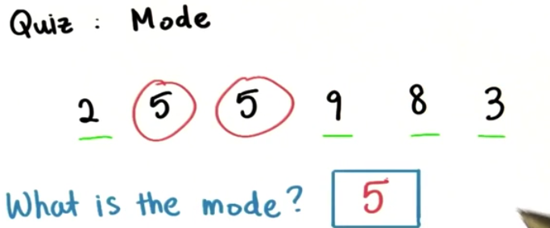
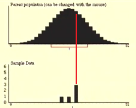
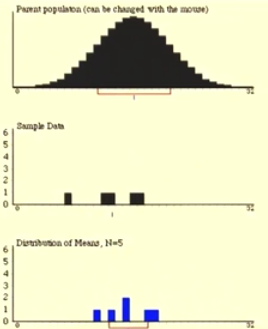

**通过分析薪水来选择专业**

需求：应该主修什么专业，例如护理专业和地理专业

解决办法：通过大量数据分析两个专业学生的薪资情况来选择。

以下是护理专业和地理专业年度收入柱形统计图：

我们想知道护理专业和地理专业的收入大约是多少？我们怎么用一些量将收入情况描述出来?

## 关注中心分布

通过能描述中心趋势的量才能代表这个整体

护理专业

通过统计图中心部分的分布来看(focus on the center of the distribution)，大部护理专业人员的年收入大约都在40,000~60,000每年

地理专业

通过统计图中心部分的分布来看，大部护理专业人员的年收入大约都在40,000~55,000每年

用一个数描述整个数据集(entire data set)

## 众数(mode)

==众数(mode)==:最高频率被称为众数(the value at which the frequency is highest is called the mode.)

正太分布的众数(mode)：

### 数据较少的时候的众数

在只有少量数据的时候，我们可以确定确切的众数

区间的众数

当数据集非常庞大的时候，我们就只能看见数据的区间，看不到具体哪个数是众数。

### 偏斜分布的众数

偏斜正太分布的众数和普通正态分布的众数一样，都是出现频率最高的区间。

### 降雨量分布的众数

众数能描述任何类型的数据，无论是数值数据还是分类数据。

通过众数我们不能知道总体样本population

众数能用任何的等式来描述

### 众数大小和什么有关

#### 改变数据样本

如果我们有数据集，这个数据集中的每个样本的众数都会相同

可以看出模拟出来的随机样本的众数都不相同，最后一个样本没有众数

#### 改变区间

改变区间能让众数的范围和大小改变

众数具体是多少，需要根据你的研究来决定

## 平均值(mean/average)

==平均值(average)==:样本的总数除以样本个数。

在这里平均值(average)就理解成均值(mean)

护理专业平均收入
$$
\overline{x}_{nurs}=\frac{58350+63120+44640+56380+72250}{5}$=58948$
$$
地理专业平均收入
$$
\overline{x}_{geo}=\frac{48670+57320+38150+41290+53160}{5}$=47718$
$$

我们可以总结出一个通用的公式来计算平均值
$$
\overline{x}_{geo}=\frac{地理专业工资的和}{地理专业的人数}=地理专业的平均工资
$$
### 样本(sample)平均数用数学符号表示

$$
\overline{x} = \frac{x_1+x_2+....+x_n}{n}
$$

$$
\sum~_{x}:样本的和~~~~n:样本个数
$$

### 总体(population)平均数

$$
\overline{\mu}=\frac{\sum_x}{N}=population_{mean/average}
$$
$$
\sum~_{x}:总体的和~~~~n:总体个数
$$

我们一般会写成这样，更加通用,可以计算样本(sample)平均值和总体population平均值

### ==均值通用计算公式==

均值可以用公式来表示
$$
\overline{x}_{mean/average}/\overline{\mu}_{mean/average}=\frac{\sum_{i=1}^{n}x_i}{n}=\frac{x_1+x_2+....+x_n}{n}
$$

### 平均值总在那些位置

> 在同一个总体下抽样的平均值差不多都分布在和总体平均值差不多的位置。
>
> 如果是正太分布，均值位于大于中间的位置

​		抽样1					抽样2					抽样3				抽样4	

​		抽样5					抽样6					抽样7				抽样8	

**插图说明**

最上面的钟形曲线是总体分布图(population)D1

中间的条形图代表抽样样本(sample)频率分布图D2

最下面的代表每次抽样的平均值D3

通过D1和D2可以看出，样本和总体之间是由偏差的，如果就用D2的样本来近似D1相差的就有点大，但是样本确实可以来估计总体，只是准不准的问题

如果样本的数量等于总体，那么我们就能够100%确定要发生的事。

### 形象理解均值(mean)

分数的分布会影响到均值大小

跷跷板模型

> 数轴：跷跷板
>
> 每个样本：球
>
> 支点：平均值所在位置

下面是描述说明

数轴就像跷跷板的板子，上面画好了各种刻度，我们在上面画上不同重量的球，对应到相应的刻度位置，跷跷板的平衡点就是平均值所在的位置。这时候两边的高度保持一致，不会一边高一边低。

当在跷跷板的一边加一个球，跷跷板失去平衡，跷跷板的平衡点要向加球的一边移动才能重新平衡。

### 平均数的误导(misleading)

当有个非常大的值出现，就会将平均值天枰的平衡点移动非常远的距离，导致我们不能通过平均值来代表整体

上图中我们在地理专业增加了一个收入为500,000家伙，来计算一下地理专业这些样本平均值
$$
\overline{x}_{geo} = \frac{48,670+57,320+38150+41,290+53,160+500,000}{6}=123,098
$$
很明显平均工资比大多数人的工资多出太多了,

我们把这样的因子叫做==异常值(outlier)==，它导致原来的分布形状变得偏斜。

众数和平均数比较

例子：

在一般实际情况下地理专业的平均工资都是48,000$

然而，1982年开始，North Carolina大学学生的的平均工资变为了100,000$

因为North Carolina大学毕业于地理专业的学生迈克乔丹在NBA打球的工资超过500,000$

平均数会根据样本个体波动有很大变化

但是众数，对于个体基本上没影响，众数能代表大多数

## 中位数(median)

### 中位数概念

==中位数(median)==:分布的中间数叫做中位数(the value in the middle of the distribution called the median)

### 得到中位数的方法

从小到大排列，或者从大到小排列数据

#### 奇数个

如果是数据个数是奇数个例如:1,3,5,7....，那么中位数就是排在中间的那个数

#### 计算公式

$$
x_\frac{n+1}{2}
$$

#### 偶数个

如果数据的个数是偶数个例如:2,4,6,8....，那么中位数，就会是中间两个数的平均数

#### 计算公式

$$
\frac{x_{\frac{n}{2}}+x_{\frac{n}{2}+1}}{2}
$$

### 比较平均数和中位数

==异常值(outlier)==

当我们加入了异常值(outlier)500,000$时平均数和中位数进行比较

没有加入异常值之前

> mean = 47,718$
>
> median = 48,670$

加入异常值之后

> Mean = 123,098$
>
> Median = 50,915$

中位数是一个十分健壮(robust)，不善变的值，它在统计学中的意义非凡，它不会受到偏离规范的影响

描述中心分布的量

通过描述中心趋势我们才能获得最佳，很好描述某个分布的大体情况

中位数

众数：也不能描述中心

平均数：平均数

只有中位数能够紧跟分布中心，只有能描述中心的量才能代表这个分布整体

## 总结

|           | 有简单的描述等式 | 会根据任何数据的改变而改变 | 改变区间对该值没影响 | 不会受到异常值的干扰 | 能在直方图中很快找到 |
| :-------- | :------: | :-----------: | :--------: | :--------: | :--------: |
| 平均值Mean   |   Yes    |      Yes      |    Yes     |            |            |
| 中间值Median |          |               |    Yes     |    Yes     |            |
| 众数Mode    |          |               |            |    Yes     |    Yes     |

