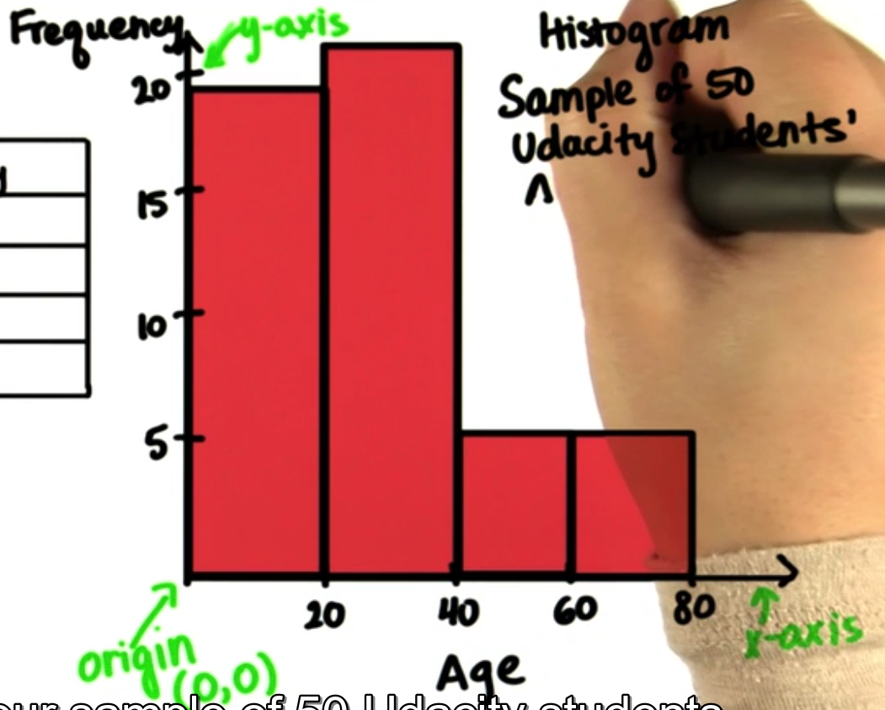
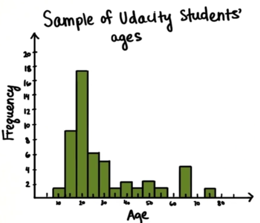

# 数据可视化

## 基本概念

只看表格很难看出什么，看看那个国家出现的最多

 

### ==频率(frequency)==

> 关注事件出现的次数

通过频率(frequency table)表我们能很容易看出

### ==相对频率(Relative Frequency)==

>  相对频率能看出部分频率和总体之间的关系，表示成分数或者小数的形式

也就是,比例(proportion)：

>==频率范围==:总是在0~1之间(All proportions are always between or equal to 0 and 1)
>
>==相对频率之和==:所有事件在总事件的相对频率的和相加等于1

$$
\frac{频率}{总体数}=相对频率(Relative Frequency)
$$

### ==百分比(percent)==

另一种展示相对频率的量,比例乘以100
$$
proportion\times100=percent
$$

有了百分比，我们就不用去看那令人头痛的数或者分数了，我们 可以用整数(whole numbers)来研究相对频率.

> ==百分比的范围==:0%~100%
>
>  ==百分比之和==:100%

### 基本概念的总结：

从这些数据中可以得到：

频率:

相对频率:

不同国家学生所占的比率:

频率的范围:

频率之和:

百分比：

还有更多的数据可以分析，这取决于你要怎么分析什么。

## 可视化步骤

### 1.未处理的杂乱数据

在统计杂乱(messy set of data)的数字类型的数据时，我么可以使用区间来让频率变得好分析，因为这样可变的区间能看出不同的数据。

### 2.区间化杂乱数据

如果我们每个年龄都统计的话，就非常麻烦于是我们使用区间来表示每一行：

对于这样杂乱数字类型的数据时，还可以用可视化的办法，就用上面这张4区间(4 bins)表来绘制。

### 3.可视化区间表

条形图/柱状图(bar graph/histogram)

频率(frequency)往往再Y轴(y -axis)

变量(variable)往往在X轴(x-axis):这里的变量是年龄age

现在区间的中间点，对应高度点上点

之后把条画完整

==组距==(bin size)

组距分为x轴组距(x-axis bin size)还有y轴组距(y-axis bin size)

观察X轴组距(interval size)

以下是相同数据集的不同组距的条形图，可以看出，组距越小，能分布的区间就越多。

​		    组距过小				  合适组距					组距过大

我们画出一个比较合适的组距条形图

分析最大频率区间

可以看出最大年龄区间是
$$
(20-2.5，20+2.5）=(17.5,22.5)
$$

最高的条中包括了18,19,20,21,22岁的人

分析60岁以下的人

从表中可以看出有4人在(62.5,67.5)岁之间，1人在(72.5,77.5)岁之间，60以上的人总共有5人占比
$$
\frac{5}{50}\times100\%=10\%
$$
分析60岁以上的人

总共有50人60岁以下的人有45个，人占比
$$
\frac{45}{50}\times100\%=90\%
$$
有多少人是20岁的

我们从这张图中看不出有多少人小于20岁，我们可以在条形图中看出许多，但是有很多细节我们还是看出来。

这张图中可以看出学生来自不同地方的占比。

## 两种柱状图

条形图和直方图的比较

​						(直方图)histogram                             	(条形图)bar graph

左边是(直方图)histogram，右边是(条形图)bar graph

### 直方图histogram

- 条之间是连续的
- 可以定义区间的
- 按照顺序排列
- x轴都是数值/数量上的(numerical/quantitative)

### 条形统计图bar graph

- 条之间是离散的

- 每一条都是不同的类别

- 不能定义区间

- 由于类之间完全不同，所以条和条之间是有空隙的

- 按照自己的意愿排序，例如我们要看哪个洲的学生最多。

- x轴都是分类/性质(categorical/qualitative)

## 两种分布

### 正太分布(normally distributed)

观察Y轴(Y-axis)的组距

> 下面的三幅图是调查252名男性体脂百分比的统计图
>
> y轴是频率
>
> x轴是体脂百分比   

​		    组距过小				  合适组距					组距过大

无论组距怎么变，我们总能看出什么？

我们能看出

形状大概是个normally distributed(正太分布)

大部分分数落在20%左右

大部分的人落在中间的区域

5%以下还有35%以上的人相对来说越来约少

我们不能看出

体脂最高的人分数是35%体脂

`0~10`的人比`18~24`的人多

### 偏斜正太分布(positively skewed distribution)

我们可以看出(虽然看不清。。。。)

它是不对称(not symmetrical),它是歪斜的(skewed),大部分人分布在左边。

大部分普通家庭收入少于25000$

大部分家庭收入少于100000$

## 总结

==频率(frequency)==:事件出现的次数

==相对频率(Relative Frequency)==:相对频率能看出部分频率和总体之间的关系，表示成分数或者小数的形式

>==频率范围==:总是在0~1之间(All proportions are always between or equal to 0 and 1)
>==相对频率之和==:所有事件在总事件的相对频率的和相加等于1

==百分比(percent)==:另一种展示相对频率的量,比例乘以100

>==百分比的范围==:0%~100%
>
> ==百分比之和==:100%

==可视化数据步骤==

1.未处理的杂乱数据

在统计杂乱(messy set of data)的数字类型的数据时，我么可以使用区间来让频率变得好分析，因为这样可变的区间能看出不同的数据。

2.区间化杂乱数据

把数据分成区间

3.可视化区间表

将区间化的数据,画在直角坐标上,y轴一般为频率,x轴一般为变量数据区间.

两种条形图
==直方图histogram==

- 条之间是连续的
- 可以定义区间的
- 按照顺序排列
- x轴都是数值/数量上的(numerical/quantitative)

==条形统计图bar graph==

- 条之间是离散的
- 每一条都是不同的类别
- 不能定义区间
- 由于类之间完全不同，所以条和条之间是有空隙的
- 按照自己的意愿排序，例如我们要看哪个洲的学生最多。
- x轴都是分类/性质(categorical/qualitative)

两种分布

==正太分布(normally distributed)==

==偏斜正太分布(positively skewed distribution)==