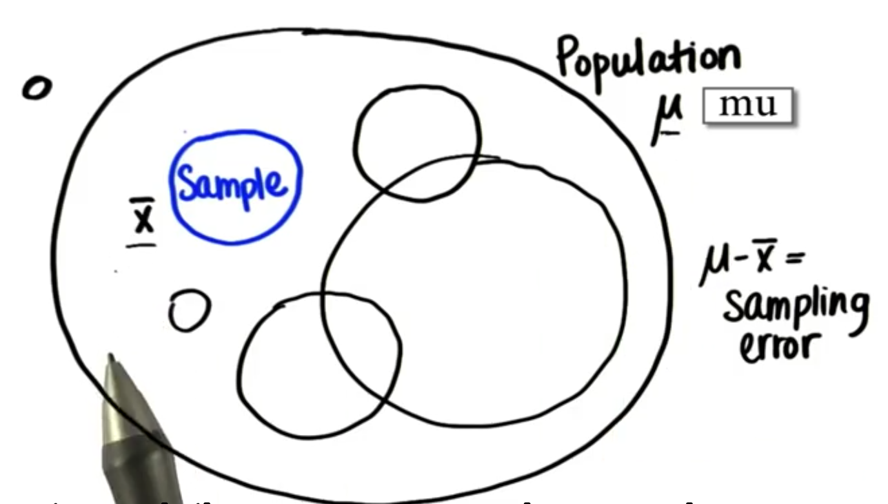
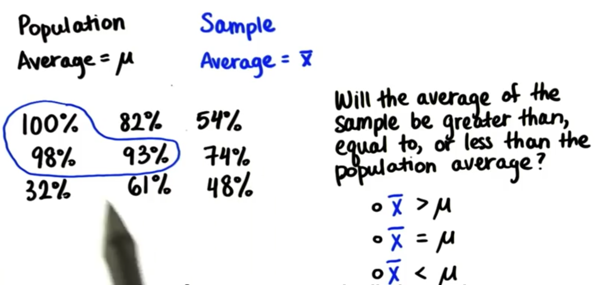
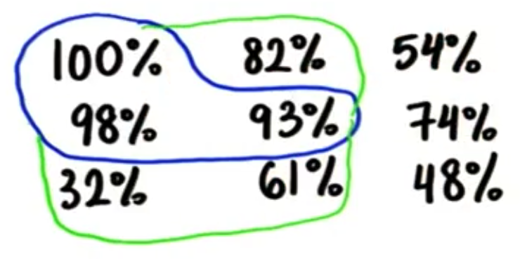
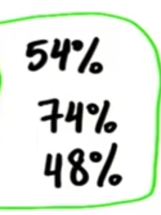
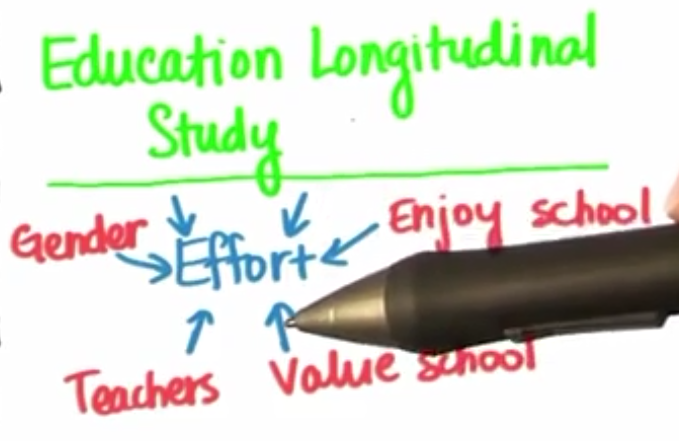
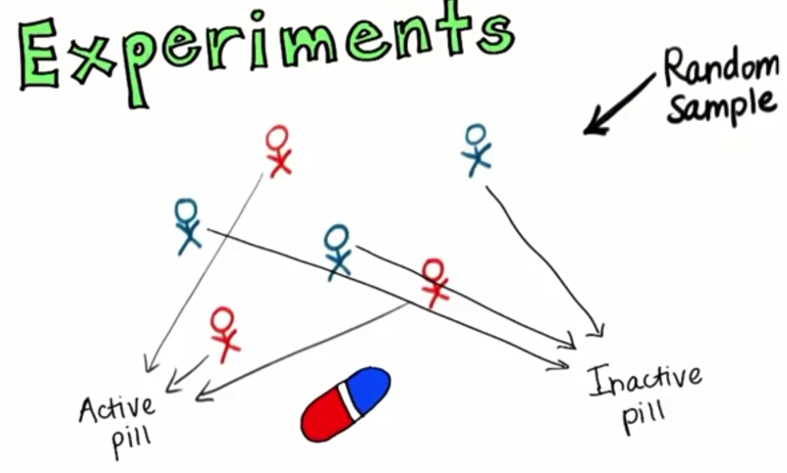
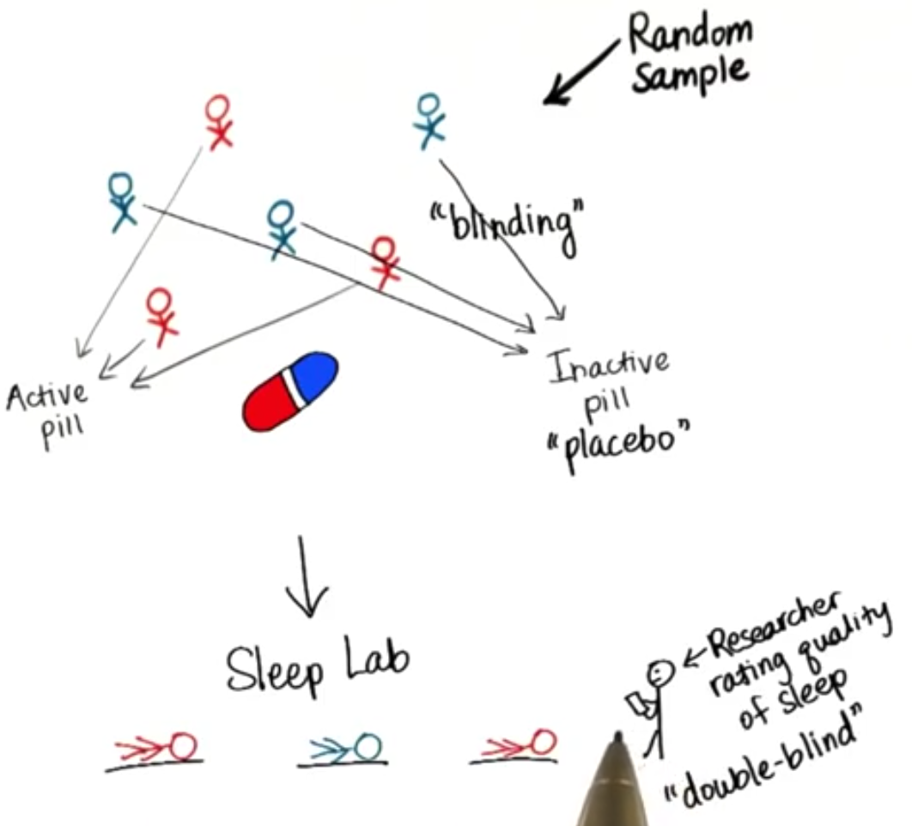
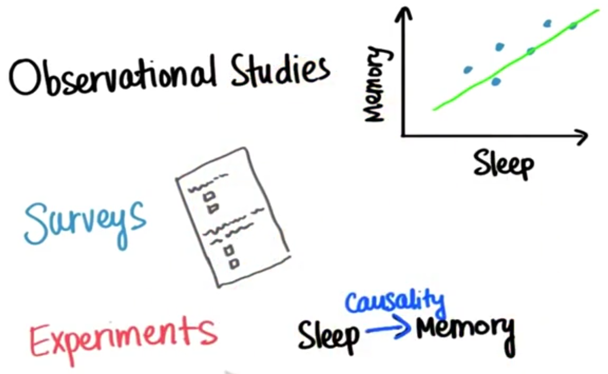

## 我们会学习些什么？

第一部分学习如何通过手算，还有GOOGLE表格工具计算数据

第二部分通过计算工具来汇聚，组织，计算，可视化数据 集合

如何获得有效的调查？

以下是我们需要考虑到的因素，在数据调查中我们需要根据以下内容来进行有效的研究

> 合适的样本尺寸
>
> 有代表性的样本
>
> 合适的方法论

## 量度构造

### ==量度构造(measure constructs)==:

>构建一种测量事物方法,比如测量有多开心

不同的人有不同的定义方法

案例：记忆力和学习成绩之间的关系

在没有办法确定和分析记忆力和什么有关系的时候我们怎么去测量记忆力？

BBC有一个记忆人脸来测试记忆力的测试

**BBC测量记忆力的方法**

在第一部分和第二部分认出来的人脸数占总数的百分比

认出特定脸的类型会给你加分

定义抽象概念

**Q1什么是幸福？**

路人A：和平就是幸福

路人B：(a fulfilled life)充实的人生

路人C：带给其他人快乐

**Q2如何测量幸福感？**

路人A：每天微笑的次数？

**Q3如何测量记忆？**

路人A：你能记住过去多少东西

**Q4：如何定义痒(itchiness)?**

路人A：一种很不舒服的感觉

路人B：很烦很刺激，然后你会去抓它

**Q5如何去量化瘙痒程度？**

路人A:记录下抓挠次数

**Q6如何测量压力？**

路人A：测量心跳

**下列量哪些是需要构建来测量的(is constructs)？**

- [ ] 汽油的加仑数:本来就是个可以测量的量，就不用去构建

- [x] 聪明度(Intelligence)：通过IQ测试 ，成绩
- [x] 努力程度(Effort):工作时间，写作业时间 GPA
- [x] 饥饿程度(Hunger):肚子叫的次数
- [ ] 以美元计算的年薪
- [x] 瘙痒程度(Itchiness):挠痒痒次数

## 调查中的影响

数据是统计学的核心

通过得到的样本数据作图，能发现睡觉越多，短期记忆越强

影响记忆的因素

- [x] 做测试题的时长(time of day you took the test)
- [x] 压力大小(stress level)
- [x] 5分钟的休息(5-min breaks)
- [x] 年龄(age)
- [x] 注意力(attention)
- [ ] 冥王星的质量(Mass of Pluto)
- [ ] 牛奶的价格(price of milk)
- [ ] 夏威夷的棕榈树数量(number of palm trees in Howaii)

控制这些可能影响记忆力的因素，改变其中一个来研究，能让结果更可信。

### ==潜在变量(lurking variables)==：

> 可能影响研究结果准确度的因素，叫做潜在变量

对于我们得出的研究结论一定可信么？我们看看如下的概念。

## 总体样本平均值&抽样样本平均值&抽样误差

我们可以在总体样本(Population)中画出许许多多或大或小的样本范围,每个样本范围内的平均值都不同，所调查的的样本(Sample)区域是总体样本的子集。

#### ==总体平均值(Population average)==:

> 总体样本平均值也叫做总体参数(Population parameter)，读作(mu)

$$
总体参数(population~averager):	\mu
$$
#### ==样本平局值(Sample average)==:

> 样本平均值也叫做样本统计值(Sample statistic)，读作(x bar)

$$
样本平均值(Sample average):\overline{x}
$$
一般情况下我们使用样本统计值(Sample average)来近似总体参数(Population parameter),但是他们之间是有误差的，我们把总体平均值和样本平均值的差叫做抽样误差(sampling error)。

#### ==抽样误差(sampling error)==:

> 总体参数和样本统计值的插值

$$
\mu-\overline{x} = sampling~error(抽样误差)
$$

总体平局值和抽样平均值是有误差的，造成了我们的预测出现不精准的情况，所以需要选择合适的抽样样本，来较小预测误差。

### 不同抽样范围对结果的影响

看上图总体数据(population)一共有9个平均值(population average)为：
$$
\mu=\frac{100\%+82\% +54\%+98\%+93\%+74\%+32\%+61\%+48\%} {9} = 71.3\%
$$
蓝线选取的三个**样本平均值为(sample average)**为:
$$
\overline{x} =\frac{100\%+98\%+93\%} {3} = 97\%
$$

可以看出**抽样误差(sampling error)**为:
$$
\mu-\overline{x}=71.3\%-97\% =-25.7\%
$$
整体平均值小于抽样平均值:
$$
\overline{x}>\mu
$$

如果抽样样本范围变得更大:

**抽样样本平均值(sample average)**
$$
\overline{x}=\frac{100\%+82\% +98\%+93\%+32\%+61\%} {6} = 77.6\%
$$
**总体样本平均值**不变
$$
\mu=\frac{100\%+82\% +54\%+98\%+93\%+74\%+32\%+61\%+48\%} {9} = 71.3\%
$$

**抽样误差(sampling error)**
$$
\mu-\overline{x}=71.3\%-77.6\%=-6.3\%
$$
可以发现总体样本平均值很接近抽样样本平均值了
$$
\mu\approx\overline{x}
$$

也有可能样本平均值小于总体平均值:

**抽样样本平均值(sample average)**
$$
\overline{x}=\frac{54\%+74\% 48\%} {3} = 58.7\%
$$
**总体样本平均值**不变
$$
\mu=\frac{100\%+82\% +54\%+98\%+93\%+74\%+32\%+61\%+48\%} {9} = 71.3\%
$$
**抽样误差(sampling error)**
$$
\mu-\overline{x}=71.3\%-58.7\%=12.6\%
$$
这时总体平均值大于样本平均值:
$$
\mu>\overline{x}
$$

### 结论

- 根据以上概念可以得出，选区合适的抽样样本对于预测的准确度很重要,我们的调查只是抽样调查，抽样调查和整体真实的情况是有误差的，所以结果并不是100%可信。
- 我们的样本数量很难接近整体数量,因为整体数量是十分庞大的,将所有对象调查完是不现实的

## 随机性(*randomness*)

在1888年，John Venn最早研究了随机性的问题，在他的书《logic of chance》中，他写道：

下落的雨滴是研究随机性最有代表性(typical)的实例(example)，因为没有人能直接猜到雨点将会落到哪里，如果我们把一张纸放到雨中，每个个雨滴都会以相同的可能性落在这张纸上然后显示出雨滴的痕迹，之后我们就获得了一个样本，这个雨滴的样本(sample)就能近似地和这整片下雨的区域(population)近似。

在选择样本的时候，我们也是随机选取的，所以总体中的个体被选为样本个体都是等可能的，就是是我们所说的随机性。

## 数据可视化(*Data visualization*)

数据可视化能帮助我们更容易得出结论，可以看出不同数据之间的关系，以及趋势。

通过数据可视化，我们能够看出大概某些数据之间的关系，但是其中有许多我们并不清楚的隐藏变量

## 研究方法(study method)

两大研究方法

**==观测研究问卷(observational studies surveys)==**
$$
Show~ Relationships\implies Observational~ Studies ~Surveys
$$

作用：展示关系(show relationships)。

如何研究：制作观测研究调查(observation studies surveys)通过绘制关系散点图(scatter plot)

**==对照实验(controlled experiment)==**
$$
Show ~Causation\implies Controlled~Experiment
$$

作用：展示原因(show causation)

如何研究：从英文中可以看出对照实验(controlled experiment)的本质，控制实验。

### yanjiu调查问卷(Survey)

经常在社会科学和行为科学中使用

==纵向研究(Longitudinal Study)==:也叫追踪研究，一段相对长时间内对同一个或同一批测试对象进行重复研究。

**优点(upsides)**

- [x] 最容易从调查总体(population)中获得信息
- [x] 成本低(inexpensive)
- [x] 可以远程操作(conducted remotely)
- [x] 任何人都可以访问和分析问卷结果(anyone can access & analyze survey results)

 **缺点(downsides)**

- [ ] 不真实的反馈(Untruthful responses)
- [ ] 有偏见的反馈(Biased responses)
- [ ] 反馈者不理解测试题目(Respondents not understanding the questions)(反应偏差Response bias)
- [ ] 测试者拒绝回答(Respondents refusing to answer)(无反应偏差Non-response bias)

### what are construct subject?

做调查问卷需要考虑那些constructs?

当我们在调查中提到construct的时候，我们一般讨论的都是construct effort，也就是哪些因素构建了我们研究的课题。

研究工作所研究的内容就是construct,这些内容组成了我们研究的内容，例如：

纵向研究(Longitudinal Study)"学习的好坏和什么有关系"这个课题,性别，对学校的喜欢程度，对老师的喜欢程度，对学校的价值观，同学们的性别。

这时我们就继续一个测量(subjective measurements)的方法来测量上面的那些constructs。

还有一点，写调查问卷(surveys)的时候真的需要注意一下措辞。

### 实验(Experiments)

安眠药对照实验(sleep medication control experiment):研究安眠药对人睡眠的影响。

方便样本(convenient sample)：很方便能找到的样本。

以下都是随机样本(random sample)：

给红色人有作用的药物(active pill)：

给蓝色人无效的药物(Inactive pill)

 Q:为什么要用无效药物(inactive pill)？

A:为了产生一个对照组，和有作用的药物组来对比。

#### ==单盲实验(single blind experiment)==

**定义**：测试者不知道自己复用的是起作用的药物还是安慰剂

事先不告诉参与者他们拿到的是有效药物还是无效药物，让他们都认为自己拿的是有有效药物。

如果让测试者认为自己拿到的是有效药物，那么我们就能控制住这个偏见误差，控制了其中一个construct。

什么时候会使用单盲：当研究员怀疑你在参加实验的时候你的行为会有异样 。

**目的**：就是为了让测试者认为自己拿的是有效药物(active pill)，而不是无效药(Inactive pill)。

**安慰剂(placebo pill):**这种无效药物(Inactive pill)就是安慰剂，吃了它不会有任何反应。

Q:为什么参与者不被告诉他们拿到的是什么药物？

A:让他们都认为自己拿到的是有效药物而不是安慰剂。

#### ==双盲实验(double blind experiment)==

**定义**：测试者和观察者都不知道谁有的是起作用的药物还是安慰剂。

**目的**：

1. 就是为了让测试者认为自己拿的是有效药物(active pill)，而不是无效药(Inactive pill)。
2. 减少观察者的主观偏差

Q:研究员来观察参与者的的睡眠质量时应该事先知道谁收到的是安慰剂还是真正的药物么？

A:不应该，如果由研究员事先知道了谁服用了真正的药物会让研究员的判断产生偏差。

==受控因素(control)==

Q:这个实验要控制哪些量？

A:只有三个是需要控制的

- [x] 参与者复用药片的时间时间
- [x] 参与者睡觉的地点
- [x] 药片的外形
- [ ] 性别
- [ ] 年龄

另外三个是随机量(randomization)，根据随机理论每组分到年龄大小的男女的机会都是相等的，所以在做随机实验的时候，样本需要取得尽量多。

控制什么(what we control)?

A:有两组记忆力测试者，一组睡觉比较少，另一组测试很多，这个实验我们需要控制什么量

==个体内研究(within-subject study)==:将同一个人研究多次

个体记忆能力的变化，之研究同一个个体，控制许多变量为常量。

## 总结

**重点**

主要学习通过观察可视化数据来进行数据分析。

我们在这一节学习了

**观察研究(Observational Studies)**：这堂课中我们更加关注观察研究，它是获得问卷数据或者是实验数据，绘制成散点图(scatter plot)来进行分析的一种研究方法；因为我们在线很难做问卷还有对照实验。

**问卷调查研究(Surveys)**：主要研究correlation相关关系

==相关关系(correlation)==：结果和construct是有相关性，一些参数的大小变化并不完全决定结果的状态

**对照试验研究(Experiments)**:主要研究==causation因果关系==

==因果关系(causation)==：结果和construct是因果关系，一些参数的大小变化完全决定结果的状态

